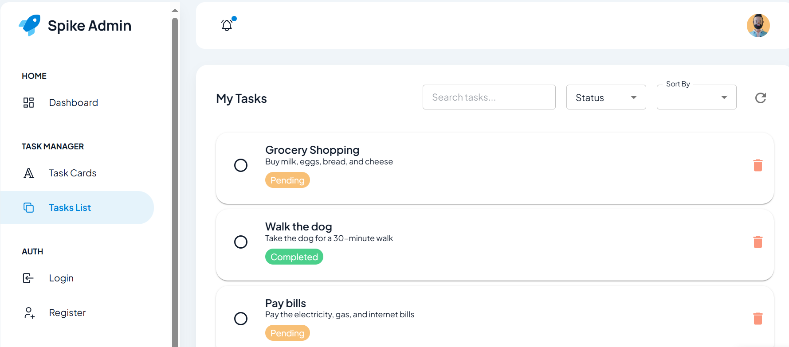
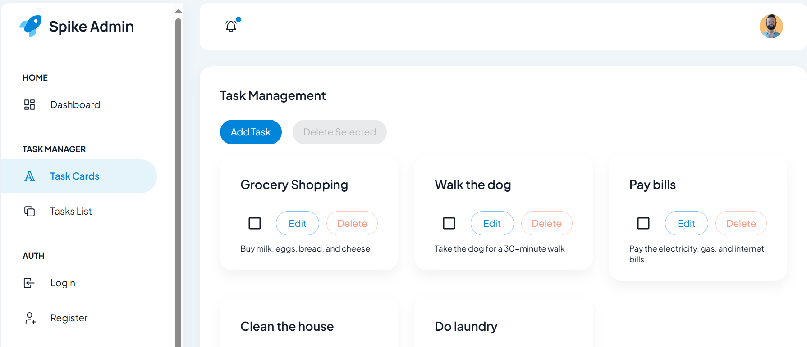
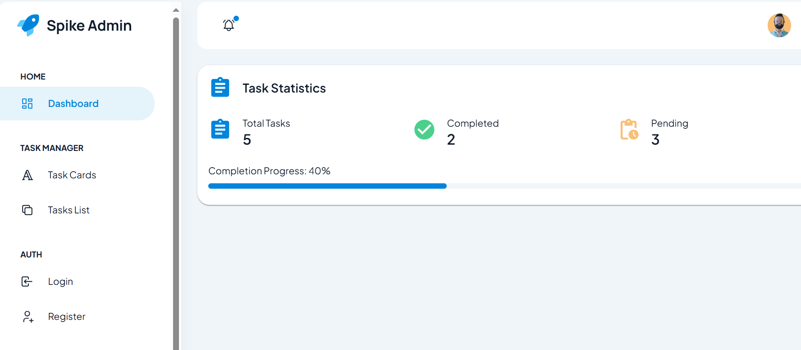

Ce projet est une application web de gestion des tâches construite avec
Next.js, Redux et FastAPI, avec une base de données MySQL. L'interface
utilisateur est basée sur le modèle d'administration gratuit Spike
Next.js
(https://www.wrappixel.com/templates/spike-next-js-free-admin-template/).

# Aperçu du projet

## Interface utilisateur (Next.js & Redux)

-   **Liste des tâches:** Visualiser, ajouter, modifier et supprimer des
    tâches.

-   **Sélection multiple et suppression de tâches.**

-   **Tableau de bord:** Visualiser les statistiques des tâches (total
    des tâches, tâches modifiées, tâches supprimées).

## Backend (FastAPI & SQLAlchemy)

-   **Base de données:** MySQL

-   **Gestion de la base de données:** Aerich pour les migrations

-   **Pas de SQL brut:** Utilise SQLAlchemy pour les interactions avec
    la base de données

# Démarrage

Pour exécuter l'application de gestion des tâches localement, suivez ces
étapes :

## Prérequis

-   **Node.js & npm/yarn** - Téléchargez-les depuis Node.js
    (https://nodejs.org/).

-   **Python 3.8+** avec pymysql, Alembic et FastAPI. Installez les
    dépendances Python nécessaires :

    `pip install pymysql alembic fastapi`

-   **MySQL** - Assurez-vous que MySQL est installé. Téléchargez-le
    depuis Téléchargements MySQL (https://dev.mysql.com/downloads/).

## Cloner le dépôt

Clonez le dépôt sur votre machine locale :

    git clone <repository_url>

## Installer les dépendances de l'interface utilisateur

Dans le répertoire du projet, installez les dépendances JavaScript
requises :

    cd <project_directory>/frontend
    npm install

ou si vous utilisez yarn

    cd <project_directory>/frontend
    yarn install

## Configurer la base de données

### Créer la base de données :

Ouvrez votre shell MySQL ou utilisez une interface graphique et exécutez
les commandes SQL suivantes pour créer la base de données :

    CREATE DATABASE my_database;

### Créer un utilisateur MySQL (facultatif) :

Si vous n'avez pas d'utilisateur de base de données, exécutez ce qui
suit :

    CREATE USER 'root'@'localhost' IDENTIFIED BY 'your_password';
    GRANT ALL PRIVILEGES ON my_database.* TO 'root'@'localhost';
    FLUSH PRIVILEGES;

### Configurer la connexion à la base de données

Créez un fichier `.env` à la racine de votre projet et ajoutez vos
informations d'identification MySQL :

    MYSQL_HOST=localhost
    MYSQL_USER=root
    MYSQL_PASSWORD=your_password
    MYSQL_DATABASE=my_database

## Exécuter les migrations

### Initialiser les migrations Alembic :

Générez d'abord le script de migration basé sur les modèles :

    alembic revision --autogenerate -m "Migration initiale"

### Appliquer les migrations :

Une fois le script de migration généré, appliquez-le à la base de
données :

    alembic upgrade head

## Exécuter l'application

### Démarrer le serveur Backend :

    pip install fastapi uvicorn
    uvicorn main:app --reload

### Démarrer le serveur de développement Frontend :

    cd <project_directory>/frontend
    npm run dev

ou

    cd <project_directory>/frontend
    yarn dev

Ouvrez votre navigateur Web et accédez à http://localhost:3000 pour
afficher l'application.

Félicitations ! Vous avez configuré avec succès l'application de gestion
des tâches.

